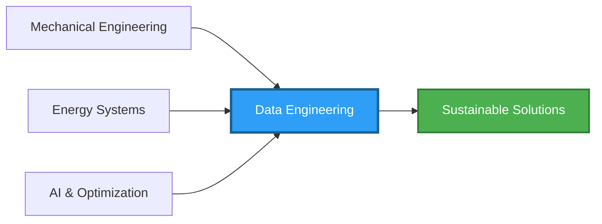
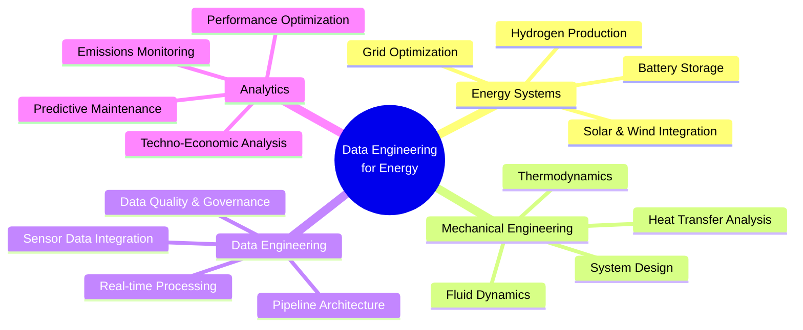
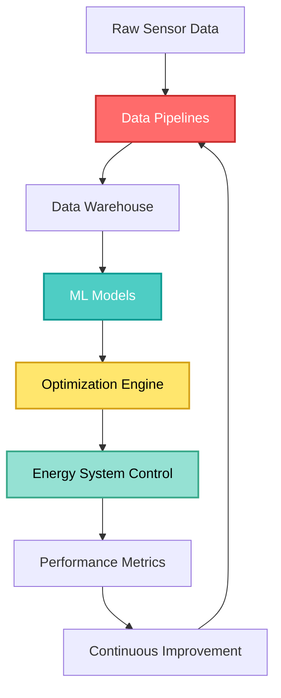

# Hi, I'm Ali Karimi 👋
### Data Engineer | Energy Systems Specialist | Mechanical Engineering Ph.D.

---

## 🚀 About Me

I am a **Postdoctoral Researcher** at the University of Stavanger, specializing in **data engineering, pipelines, and optimization** for energy systems and platforms. With a strong foundation in **Mechanical Engineering** and a passion for data-driven solutions, I bridge the gap between physical systems and intelligent software to develop **sustainable and efficient technologies**.

### 🔬 Current Focus
- 🌱 Leading R&D initiatives for **hybrid energy systems** using AI to reduce operational costs and emissions
- ⚡ Building **data pipelines** for real-time energy system monitoring and optimization
- 🔧 Designing complex systems: **modular hydrogen hubs** to **high-efficiency heat exchangers**
- 📊 Developing **predictive models** for energy consumption and system performance

### 🎓 Education & Experience
- **Ph.D. in Industrial Engineering** - University of Naples Federico II
- **5+ years** in prototyping, thermal-fluid systems, simulation (CFD, FEA), and system integration
- **Deep expertise** in techno-economic analysis and energy system optimization

---

## 💻 Technical Skills

### Data Engineering & Programming

**Core Competencies:**
- ETL Pipeline Development & Orchestration
- Data Modeling & Warehousing
- Time-Series Data Analysis
- Big Data Processing & Distributed Computing
- API Development & Integration

### Data Science & Machine Learning

**Capabilities:**
- Predictive Modeling & Forecasting
- Optimization Algorithms (Linear, Non-linear, Multi-objective)
- Neural Networks & Deep Learning
- Time-Series Forecasting (ARIMA, LSTM)
- Feature Engineering & Selection

### Cloud & DevOps

**Infrastructure & Tools:**
- Cloud Data Platforms (Azure Data Factory, AWS Glue, S3)
- Containerization & Orchestration (Docker, Kubernetes)
- Version Control & CI/CD Pipelines
- Apache Spark & Hadoop Ecosystem
- Databricks & Snowflake

### Data Visualization & BI

**Visualization Expertise:**
- Interactive Dashboards & Reports
- Real-time Monitoring Systems
- Geospatial Data Visualization
- Statistical Analysis & Reporting

### Engineering Simulation & Design

**Engineering Tools:**
- Computational Fluid Dynamics (CFD)
- Finite Element Analysis (FEA)
- Thermodynamic Modeling & Simulation
- CAD Design & 3D Modeling
- System Integration & Control

### Domain-Specific Expertise

**Specialized Knowledge:**
- ⚡ **Energy Systems:** Hybrid systems, renewable integration, hydrogen technologies
- 🔥 **Thermal Management:** Heat exchangers, cooling systems, thermal optimization
- 💧 **Fluid Systems:** Pumps, valves, flow optimization, pressure systems
- 📈 **System Optimization:** Multi-objective optimization, genetic algorithms, PSO
- 💰 **Techno-Economic Analysis:** Cost modeling, ROI analysis, lifecycle assessment
- 🌍 **Sustainability:** Carbon footprint analysis, emission reduction, green technologies

---

## 📊 GitHub Analytics

<!--
If the dynamic stats images below don't load, it may be due to API rate limits or service availability.
Visit my GitHub profile directly: https://github.com/karimialii
-->

---

## 🏆 Key Strengths

<table>
<tr>
<td width="50%" valign="top">

### 🔧 Engineering Background
- Deep understanding of **physical systems**
- Expertise in **thermal-fluid dynamics**
- Experience with **sensor data & IoT**
- Hands-on prototyping & testing
- System-level thinking

</td>
<td width="50%" valign="top">

### 💾 Data Engineering Skills
- **ETL pipeline** design & optimization
- **Streaming data** processing
- Data quality & governance
- **Scalable architecture** design
- Performance tuning & monitoring

</td>
</tr>
<tr>
<td width="50%" valign="top">

### 🎯 Energy Domain Expertise
- **Renewable energy** integration
- Energy efficiency optimization
- **Smart grid** technologies
- Demand forecasting
- Emission reduction strategies

</td>
<td width="50%" valign="top">

### 🤝 Cross-Functional Skills
- **Interdisciplinary** collaboration
- Technical documentation
- Project management
- Stakeholder communication
- Research & innovation

</td>
</tr>
</table>

---

## 🌟 What Sets Me Apart

> 💡 **Unique Blend:** I combine mechanical engineering principles with modern data engineering practices to solve complex energy challenges. This rare combination allows me to:
> - Understand the **physics** behind the data
> - Design **efficient data pipelines** for sensor-rich environments
> - Build **predictive models** grounded in engineering fundamentals
> - Bridge communication between engineering teams and data teams

---

## 📫 Let's Connect!

I'm always interested in collaborating on projects related to **data engineering**, **energy systems**, and **sustainable technologies**. Whether you're working on renewable energy optimization, IoT data pipelines, or innovative mechanical systems, let's connect!

---

### "Transforming energy systems through data-driven innovation" 🌍⚡

